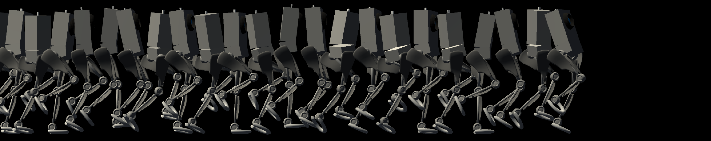
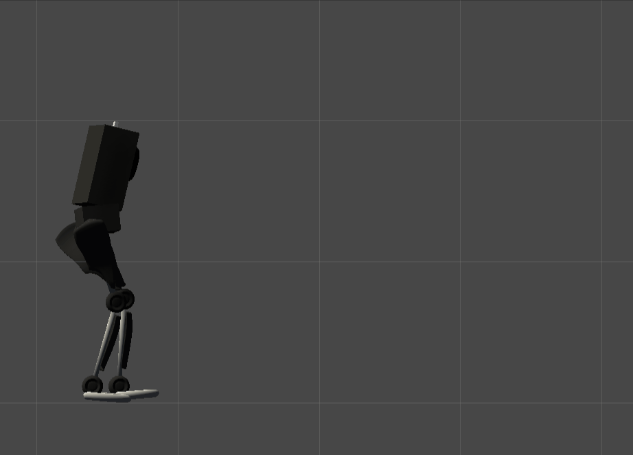
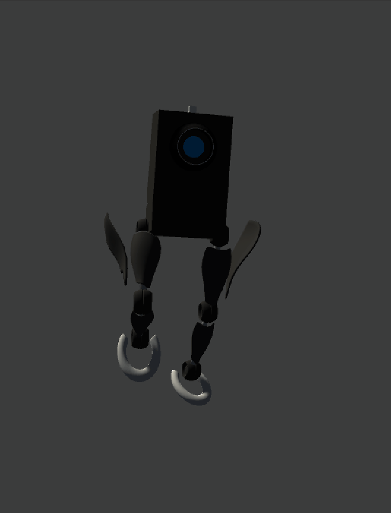
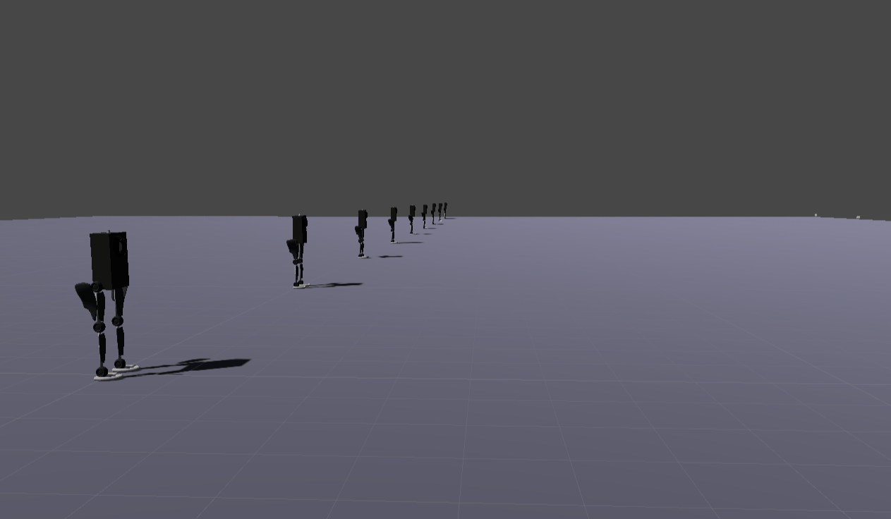
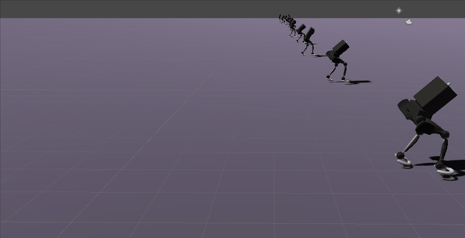

### </img>
# biped_robot

>This project leverages the Unity ML-Agents to teach a physics based character various locomotion.
The current version includes both an Inference branch which features the latest version of a trained policy,
as well as a Training branch, which holds the training configuration.
Follow the installation instructions below to explore the project on your own.

### Requirements
- Unity version 2018.3.7f1
- ML-Agents version 0.7.0


### Unity
- download Unity Hub <a href="https://public-cdn.cloud.unity3d.com/hub/prod/UnityHubSetup.exe" target="_blank"> here </a>
- follow the instructions of the installer and install Unity version 2018.3.7f1
### Setup ML-AGENTS
- for unix systems <a href="https://github.com/Unity-Technologies/ml-agents/blob/master/docs/Installation.md" target="_blank"> click here </a>  for an installationguide
- for windows systems <a href="https://github.com/Unity-Technologies/ml-agents/blob/master/docs/Installation-Windows.md" target="_blank"> click here </a>  for an installationguide

### Clone

- Clone this repo to your local machine using

### How to see what they have learned so far
* Checkout the Inference branch
* Start Unity and load the Project
* Click the playbutton and watch the result
* This branch features three skills: walking backwards; walking forward; standing still
* Skills can be controlled by the 'S' and 'W' keys on the keyboard
###
walking bots; three skills |  running
:-------------------------:|:-------------------------:
  |  

### How to start the learning-process inside the editor
* Checkout the learning branch
* Start unity and load the project
* Start "Anaconda Prompt", navigate to the project dir and use this command to ready the learning process
* Press Play in the Unity Editor to start the learning process
```sh
mlagents-learn config/robot_config.yaml --train --run-id=<run-id> 
```


### How to start the learning-process with a build project
* Checkout the learning branch
* Start unity and load the project
* Build the project (click file -> Build Settings -> Build and choose a location to store the executable project)
* Start "Anaconda Prompt", navigate to the project dir and use this command to start the learning process
```sh
mlagents-learn config/robot_config.yaml --env=<full/path/to/UnityEnvironment.exe> --train --run-id=<run-id>
```

### Outtakes:




